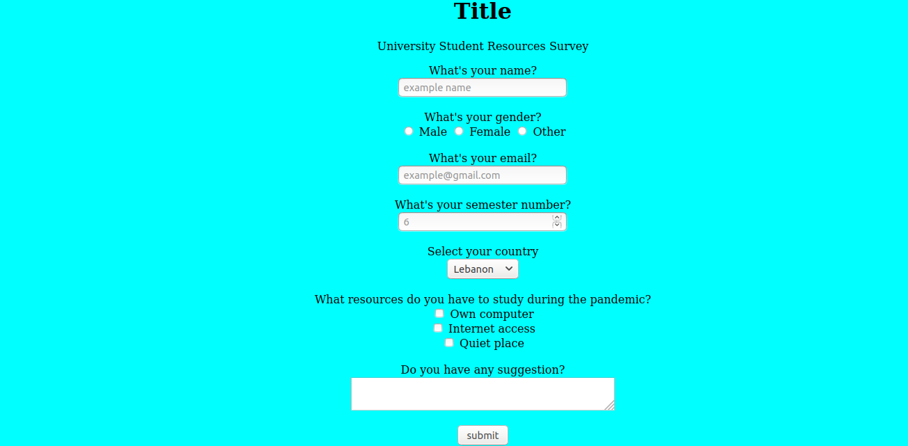

# Review_Project_Trial

> One paragraph statement about the project.

Additional description about the project and its features.

## Built With

- Html and CSS

## Getting Started

**This is an example of how you may give instructions on setting up your project locally.**
**Modify this file to match your project, remove sections that don't apply. For example: delete the testing section if the currect project doesn't require testing.**

To get a local copy up and running follow these simple example steps.

### Prerequisites

### Clone git repo

### Run the index.htm

## Authors

👤 **Author1**

- GitHub: [@m05e5](https://github.com/m05e5)

## Show your support

Give a ⭐️ if you like this project!

## Acknowledgments

- Thanks to Arturo Ortega for sharing one of his admission trial work with me
- Inspiration
- etc

## 📝 License

This project is [MIT](./MIT.md) licensed.
